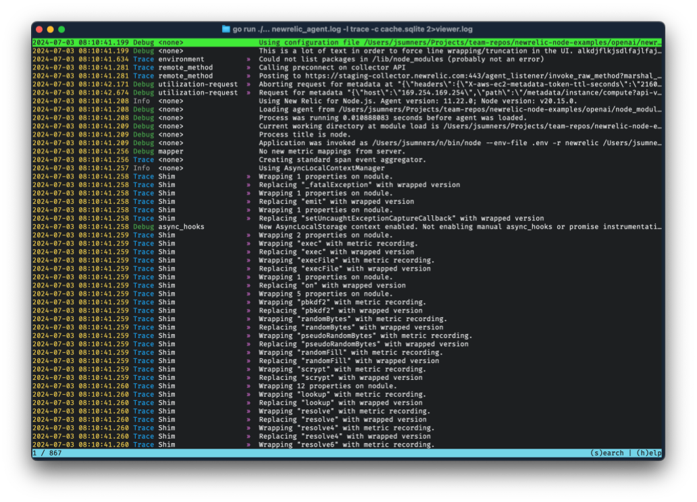

# New Relic Node.js Agent Logs Viewer

> [!IMPORTANT]
> This is an ongoing work in progress. Expect to encounter bugs.
> We expect this tool to improve over time as we use it and learn what we
> want out of it.

This tool reads, parses, and presents [New Relic Node.js Agent][troubleshooting]
troubleshooting logs.

```sh
$ nrlv -f newrelic_agent.log 2>nrlv.log
```

Lines with `»` preceding the message string have more information available by
selecting the line and pressing the `enter` key.

Note: the log viewer writes its own internal logs to `stderr`.

## Installation

### Go Install

This tool supports being installed directly with the
[`go install`](https://go.dev/ref/mod#go-install) command:

```sh
go install github.com/newrelic/node-log-viewer@latest
```

### Homebrew

This tool is installable via [Homebrew](https://brew.sh/):

```sh
brew install newrelic/agents/node-log-viewer
```

Note: this is the preferred installation method. This is the easiest way to
install the tool on macOS without needing to utilize the
["open anyway"](https://support.apple.com/en-us/102445#openanyway) work around.

## Application Usage

### Typical Case

The intended typical use case is:

```sh
nrlv newrelic_agent.log
```

The result of that will be a TUI representation of the log file that looks
similar to the following screenshot:



### Collecting Remote Delivery Logs

Sometimes we are only concerned with the logs around sending data to the
remote collection server. We can filter a log file down to only the relevant
remote communication logs like so:

```sh
nrlv newrelic_agent.log --dump-remote-payloads > remote.log
# Which can also be viewed with the viewer:
nrlv remote.log
```

### Retaining The Cache

The log viewer parses the agent log file and stores the parsed data in
a temporary SQLite database. If a log file is particularly large it can be
helpful to retain the cache for use with subsequent runs:

```sh
nrlv newrelic_agent.log --cache-file ./cache.sqlite --keep-cache
# Or a little less verbose:
nrlv newrelic_agent.log -c ./cache.sqlite -k
```

If the `--keep-cache` switch is omitted, the cache file will be removed when
the log viewer exits.

### Navigation

The application has two distinct views: "lines view" and "line detail view."
The lines view is a scrollable list of all log lines showing the timestamp,
log level, log component, and log message for each log line. The line detail
view is what is shown when choosing a log line from the lines view to inspect.
It shows all pertinent information from the log along with any embedded data
in an easy to review format.

+ Lines view:
    * `up arrow`, `j`: move line selection down
    * `down arrow`, `k`: move line selection up
    * `enter`: view detail of selected line
    * `s`: open search box
    * `g`: open go to line box
    * `q`, `ctrl+c`: quit the application
+ Line detail view:
    * up/down navigation is same as lines view
    * `esc`: return to lines view
  
## Development Tips

### Use proj_root/local

Create a directory named `local` in the root of the project, and you can store
local test resources within it. These resources will not be added to the
project.

### Running To Test Changes

It is easiest to verify your changes are working by actually trying to use
them in the application and referring to the logs when something breaks.
To do so:

```sh
go run ./... local/some.logfile -l trace -k -c cache.sqlite 2>viewer.log
```

That will build the current source code, read the log file, cache it to a
local `cache.sqlite` file (which will be retained [`-k`]), and write trace
level application logs to `viewer.log`. Neither the `cache.sqlite` nor
`viewer.log` file will be added to the project. Remember to remove the
cached SQLite file after you are done with it, or omit `-k` if you do not
need to work with the SQLite file outside of the log viewer.

[troubleshooting]: https://docs.newrelic.com/docs/apm/agents/nodejs-agent/troubleshooting/generate-trace-log-troubleshooting-nodejs/
